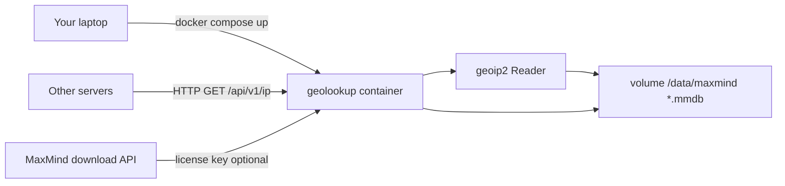

# GeoLookupService — local Docker (primary)

From this folder, start the API in a container **without a MaxMind license**. Fallback mode is on by default.

```bash
cd geolookup-service
cp .env.example .env          # optional; defaults already work
docker compose up --build
```

Then:

```bash
curl -s http://127.0.0.1:8080/health
curl -s "http://127.0.0.1:8080/api/v1/ip?address=8.8.8.8"
open http://127.0.0.1:8080          # small lookup UI
```

If you later add `MAXMIND_LICENSE_KEY` (and `MAXMIND_ACCOUNT_ID`) to `.env`, restart the stack. GeoLite2-City + GeoLite2-ASN download into the named volume `geolookup-maxmind-data` mounted at `/data/maxmind`.

```bash
docker compose up --build -d
docker compose logs -f geolookup
```

Stop:

```bash
docker compose down          # keep downloaded MMDB files
docker compose down -v       # also delete the MaxMind volume
```

Equivalent without Compose:

```bash
docker build -t geolookupservice:local .
docker run --rm -p 8080:8080 \
  --name geolookup \
  -e MAXMIND_ALLOW_FALLBACK=true \
  -v geolookup-maxmind-data:/data/maxmind \
  geolookupservice:local
```

---

Long-running HTTP service that other servers query for **IP → geo** (city, country, lat/long, timezone, ISP/ASN) using local [MaxMind](https://www.maxmind.com/en/home) GeoLite2 / GeoIP2 `.mmdb` files.

It replaces copying MaxMind databases onto every host. One container downloads and refreshes the databases; everyone else calls the API.

## Why this exists

| Before | After |
| --- | --- |
| Each app downloads GeoLite2-City / ASN (or someone copies files by hand) | GeoLookupService downloads on a schedule into a volume |
| Lookups happen in-process and go stale when the DB is not updated | Other services `GET /api/v1/ip?address=` |
| Restart required to pick up a new MMDB | Readers are swapped in place; in-flight requests keep the previous reader until a grace period |

## Architecture



- **API process** (`python -m geolookupservice`) serves FastAPI, loads `geoip2` readers, and watches MMDB mtimes.
- **Updater** (`python -m geolookupservice.updater`) pulls `GeoLite2-City` and `GeoLite2-ASN` (configurable) from MaxMind, verifies sha256 when available, and atomically replaces files on disk.
- If no MMDB is present, **fallback mode** (`MAXMIND_ALLOW_FALLBACK=true`, the Docker default) serves a tiny demo dataset (public resolvers such as `8.8.8.8`). That path is for local bring-up and tests — not production accuracy.

## API

| Method | Path | Purpose |
| --- | --- | --- |
| `GET` | `/health` | Liveness. Always 200 if the process is up. |
| `GET` | `/ready` | Readiness. 200 if an MMDB is loaded **or** fallback is enabled. 503 otherwise. |
| `GET` | `/api/v1/status` | Mode, DB paths, last reload/download, whether a license is configured. |
| `GET` | `/api/v1/ip?address=` | Lookup one IPv4/IPv6. Omit `address` to use `X-Forwarded-For` / `X-Real-IP` / peer IP. |
| `POST` | `/api/v1/ip/batch` | Body `{"addresses": ["8.8.8.8", "1.1.1.1"]}` (max 50). |
| `GET` | `/api/v1/search?q=` | City catalog search (demo dataset). |
| `GET` | `/api/v1/reverse?lat=&lon=` | Nearest catalog city. |
| `GET` | `/api/v1/distance` | Great-circle distance (`from_lat`… or `origin`/`destination` city names). |
| `GET` | `/docs` | OpenAPI. |

```bash
curl -s "http://127.0.0.1:8080/api/v1/ip?address=8.8.8.8"
```

```json
{
  "ip": "8.8.8.8",
  "version": 4,
  "network_type": "public",
  "is_private": false,
  "found": true,
  "source": "fallback",
  "location": {
    "city": "Mountain View",
    "region": "California",
    "country": "United States",
    "country_code": "US",
    "latitude": 37.4056,
    "longitude": -122.0775,
    "timezone": "America/Los_Angeles"
  },
  "isp": "Google LLC",
  "org": "Google LLC",
  "asn": 15169,
  "message": "Using built-in fallback dataset; MaxMind MMDB is not loaded"
}
```

From another service, treat GeoLookupService as `http://127.0.0.1:8080` on a laptop, or Kubernetes Service DNS `geolookup.geolookup.svc.cluster.local` in a cluster.

## Environment variables

Copy `.env.example` to `.env` in this folder. Compose reads `.env` automatically. **Never commit a real key.**

| Variable | Default | Notes |
| --- | --- | --- |
| `MAXMIND_LICENSE_KEY` | empty | Required to download databases. Leave empty to run immediately in fallback mode. |
| `MAXMIND_ACCOUNT_ID` | empty | Used with the permalink download API (`Basic` auth). If unset, the legacy `license_key` query URL is used. |
| `MAXMIND_DATA_DIR` | `/data/maxmind` | Path **inside the container**. Persist it with the Compose volume. |
| `MAXMIND_EDITIONS` | `GeoLite2-City,GeoLite2-ASN` | Comma-separated MaxMind edition IDs. |
| `MAXMIND_UPDATE_INTERVAL_HOURS` | `24` | In-process refresh interval. `0` disables the loop. |
| `MAXMIND_ALLOW_FALLBACK` | `true` | Docker default. Set `false` in production so `/ready` fails closed until an MMDB is loaded. |
| `GEOIP_CITY_DB_PATH` / `GEOIP_ASN_DB_PATH` | discovered | Optional explicit file paths. |
| `HOST` / `PORT` | `0.0.0.0` / `8080` | Bind address. |
| `LOG_LEVEL` / `LOG_FORMAT` | `info` / `text` | `LOG_FORMAT=json` for production. |
| `CORS_ORIGINS` | `*` | Comma-separated list, or `*`. |

You need a MaxMind account and a GeoLite2 license key only if you want real GeoIP data: [GeoLite2 signup](https://www.maxmind.com/en/geolite2/signup). Accept the GeoLite2 license in the MaxMind portal or downloads return 403.

## Local run without Docker

```bash
cd geolookup-service
python3 -m venv .venv
source .venv/bin/activate
pip install -r requirements-dev.txt
export MAXMIND_DATA_DIR="$PWD/data/maxmind"
export MAXMIND_ALLOW_FALLBACK=true
python3 -m geolookupservice
```

One-shot download (also used as a Kubernetes init container):

```bash
python3 -m geolookupservice.updater
```

## Kubernetes (optional, no Helm)

Build the same image this folder's Dockerfile produces, load it into the cluster, then:

```bash
kubectl create namespace geolookup --dry-run=client -o yaml | kubectl apply -f -
kubectl -n geolookup create secret generic geolookup-maxmind \
  --from-literal=MAXMIND_ACCOUNT_ID="$MAXMIND_ACCOUNT_ID" \
  --from-literal=MAXMIND_LICENSE_KEY="$MAXMIND_LICENSE_KEY" \
  --dry-run=client -o yaml | kubectl apply -f -
kubectl apply -k k8s/
```

What `k8s/` includes:

- **Deployment** with an **init container** that runs `python -m geolookupservice.updater` into the PVC, then the API container. Liveness `/health`, readiness `/ready`. Resource requests/limits set.
- **Service** `geolookup` (ClusterIP 80 → 8080).
- **ConfigMap** for non-secret settings (`MAXMIND_ALLOW_FALLBACK=false` for production).
- **Secret** example (`k8s/secret.yaml`) — replace placeholders.
- **PVC** `1Gi` for `/data/maxmind`.
- Optional **CronJob** (`k8s/cronjob.yaml`) weekly refresh. Apply it only if the volume is ReadWriteMany; on RWO the in-process updater plus init container is the supported path.

## Tests

Tests do **not** need a MaxMind license.

```bash
cd geolookup-service
pip install -r requirements-dev.txt
pytest
```

## Layout

```
geolookup-service/
  geolookupservice/   FastAPI app, MaxMind store, updater, fallback catalog
  tests/
  Dockerfile
  docker-compose.yml  laptop happy path
  .env.example
  k8s/                optional cluster manifests
```
